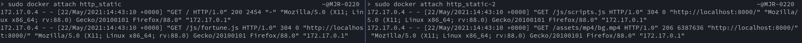
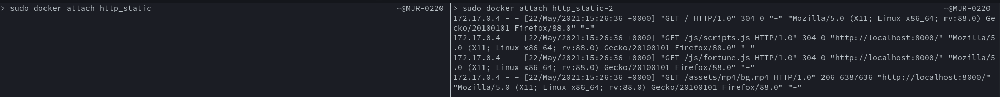

# Load balancing

NGINX est facile à configurer pour du load balancing

Lien utile :
- https://nginx.org/en/docs/http/load_balancing.html


## Configuration

Il suffit d'ajouter deux sections `upstream` dans le fichier de config de nginx:
```
    upstream static_http {
        server 172.17.0.2:80;
        server 172.17.0.5:80;
    }
    
    upstream dynamic_http {
        server 172.17.0.3:80;
        server 172.17.0.6:80;
    }
```

Dans le reverse proxy, on peut alors référencer `static_http` et `dynamic_http`, et NGINX s'occupera de faire le load balancing:
```

    location / {
        proxy_pass http://static_http/;
    }

    location /api/fortunes/ {
        proxy_pass http://dynamic_http/;
    }
    
``` 

## Démo

Voilà le résultat des logs pour une requête vers le reverse_proxy sur les deux serveurs statiques: 



On peut voir qu'ils reçoivent tous les deux des requêtes en provenance de l'adresse
172.17.0.4, qui est notre reverse proxy. Le load balancing est donc fonctionnel.

# Load balancing : Sticky session

Par défaut le load balancing de NGINX utilise la méthode round-robin ([source](https://docs.nginx.com/nginx/admin-guide/load-balancer/http-load-balancer/#method))

 Les sticky sessions avancées (cookie de session) ne sont pas supportées sur la version open-source de NGINX. Il y a cependant une alternative basique
 mais qui fonctionne à moindre échelle : [le hashage d'adresse IP du client](https://docs.nginx.com/nginx/deployment-guides/load-balance-third-party/apache-tomcat/#session-persistence-basic)
 
 C'est une solution qui fonctionne, mais qui n'est pas optimale car tous les appareils connectés au même réseau LAN auront le même hash s'ils accèdent 
 au reverse proxy depuis Internet.
 
 Ce n'est pas non plus une vraie session car il faudrait que depuis une machine, la session en cours mène vers le même serveur à chaque fois (ce qui est le cas),
 mais que chaque session puisse être traitée par un serveur différent (ce qui n'est pas le cas avec cette solution).
 
 ## Configuration
 
 Rien de plus simple, il suffit d'ajouter `hash $remote_addr;` dans la déclaration du pool pour le load balancing.
 
 Pas besoin de modifier le dockerfile. 
 
 ## Démo
 
 Logs des deux serveurs après un accès à la page web :
 
 
 
 On voit donc que toutes les requêtes de la "session" sont traitées par le même serveur. 
 
 # Dynamic Cluster Management
 
 