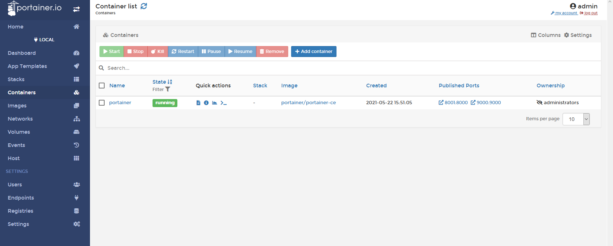
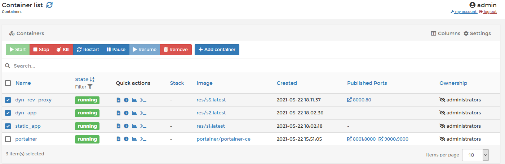

# Gestionnaire Web UI

Nous avions choisi Portainer comme outils pour la gestion des containers
dockers. Il permet très facilement de gérer les containers, images, volumes, …

## Installation

Pour l'installation, il suffit de se rendre sur 

de la documentation officiel et de suivre les instructions d'installation.

Il suffit donc en premier lieu de créer un volume pour la persistance des
données

```bash
docker volume create portainer_data
```

et ensuite de lancer un container docker

```bash
docker run -d -p 8000:8000 -p 9000:9000 --name=portainer --restart=always -v /var/run/docker.sock:/var/run/docker.sock -v portainer_data:/data portainer/portainer-ce
```

Le premier volume servira pour permettre la gestion des ressources docker
locales.

## Utilisation

Nous allons faire un petit tour de l'interface Web.

### Écran de login

Nous tout d'abord accueilli par une fenêtre de connexion où il nous faudra créer
un compte à la première connexion. Mais comme cette étape est déjà faite, il
suffit d'entrer les informations de connexion.


### Écran d'accueil

Nous pouvons apercevoir les différents groupes, mais dans notre cas, nous n'en
avons qu'un seul : local.


En cliquant dessus, nous pouvons voir les différents containers qui tournent en
local. Actuellement, il n'y a que le container avec portainer qui tourne.


###  Écran des images

Sur cette page il est possible d'avoir un aperçu des images dockers qui ont été
contruites.


###  Écran des containers

C'est ici que nous allons nous concentrer pour la gestion des containers. Nous
pouvons voir qu'il y a le container avec portainer qui tourne en ce moment. Nous
allons créer les 3 containers permettants d'avoir une infrastructure de l'étape
5.



On clique sur bouton "Add container" et on rentre les informations dont on a
besoin, dans notre cas le nom du container et celui de l'image. On fait la même
chose avec le serveur dynamique.


On rentre les informations du reverse proxy avec le port forwarding en cliquant
sur "publish a new network port".


Et on indique les variables d'environnement.


Et enfin, nous pouvons lancer les containers.


Nous pouvons voir que les containers ont bien été lancés.


Nous pouvons ensuite arrêter les containers.



Et pour témoin, on peut voir que les containers ont bien été stoppé.


## Conclusion

Nous avons surtout couvert des exemples de bases, mais portainer permet entre
autre de se connecteur via bash à un container, de modifier un container, de
gérer des containers distants et autres choses que nous n'avons pas forcément
prit le temps d'explorer car il convre déjà bien ce qui est demandé à cette
étape.

L'outils reste néanmoins agréable à utiliser et permet de se rendre compte de ce
que permet docker dans son ensemble et on ne peut que vous recommander de tester
vous même cet outils si ce n'est pas déjà fait.
