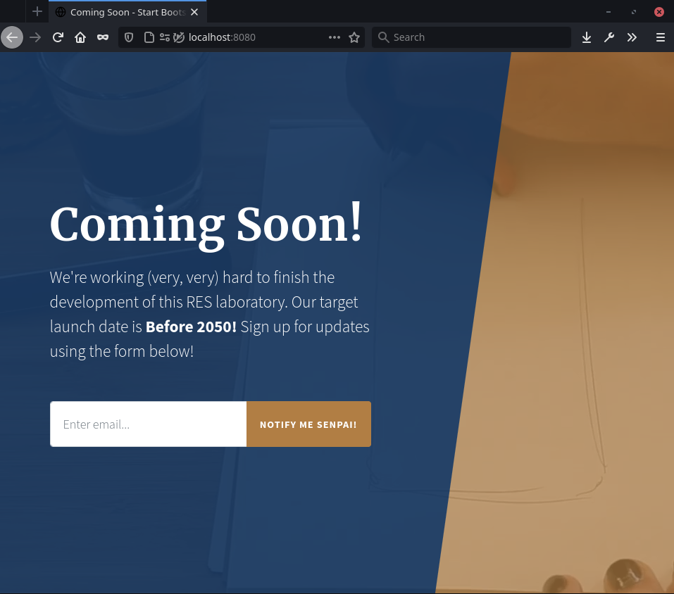

# Etape 1 : serveur NGINX

Le template que nous avons utilisé pour cette étape provient de:
https://github.com/StartBootstrap/startbootstrap-coming-soon 

## Dockerfile

Le dockerfile est très simple, il est composé de seulement deux étapes:

1. Déclarer l'image utilisée (latest): https://hub.docker.com/_/nginx

2. Copier les fichiers source situés dans `src` dans `/usr/share/nginx/html`
    - cela a pour effet de remplacer la page par d'accueil par défaut de NGINX par celle 
    de notre page statique. Il n'y a donc aucun fichier de configuration à modifier.

## Lancer l'image

Build l'image `res/s1`:

```bash
sudo docker build . -t res/s1
```


Lancer un container (temporaire):

```bash
sudo docker run -p 8080:80 --rm res/s1 
```

## Test

Une fois qu'on a lancé le container, on peut se rendre sur `http://localhost:8080`:

