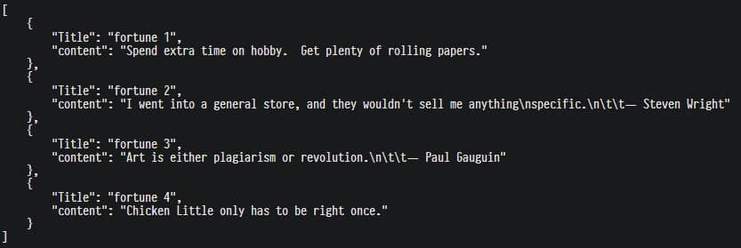

# Etape 2

Pour cette étape nous avons décidé d'utiliser **GoLang** comme serveur
dynamique. C'était pour nous deux l'occasion de tester ce langage qui est plutôt
simple à prendre en main et de plus en plus utilisé.

Ces tutoriels nous ont été très utiles: 
- [Apprentissage de GoLang](https://tour.golang.org/welcome/1)
- [REST API en GoLang](https://tutorialedge.net/golang/creating-restful-api-with-golang/#marshalling)

## Code GO

Pour faire la lecture du fichier `fortunes`, nous avons utilisé
[ce repo](https://github.com/bmc/fortune-go) car le parsing était déjà effectué.

## Configuration

Nous travaillons dans le répertoire `/usr/local/go/src/app`, qui est un
sous-dossier du répertoire `$GOROOT`. Sans cela, il ne serait pas possible de
compiler l'application.

Il faut premièrement initialiser un module avec la commande `go mod init <nom>`

Après avoir copié le fichier *.go* dans le répertoire courant, il faut installer
les dépendances avec `run get` 

On peut ensuite compiler et installer l'application avec `go install`

La commande pour exécuter l'application est : `go run <nom>`

## Dockerfile

L'image Docker utilisée est l'image officielle de GoLang sur Dockerhub:
https://hub.docker.com/_/golang

Toutes les manipulations de configuration décrites ci-dessus sont exécutées dans
le dockerfile.

Pour exécuter le dockerfile, c'est la même chose que d'habitude, mais attention:
- Ctrl+C ne stoppe pas le container, alors il vaut mieux run le containeravec
  l'option `--detach` et stopper manuellement avec `docker stop <image>`

## Test

