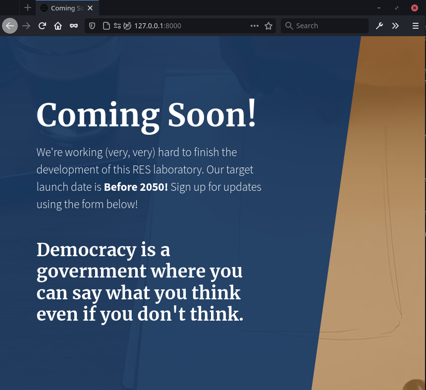
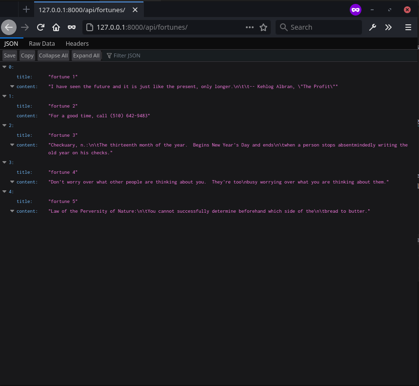

# Etape 3

Nous avons utilisé NGINX pour sa fonctionnalité de reverse proxy.

Nous nous sommes aidés de ces liens: 
- https://docs.nginx.com/nginx/admin-guide/web-server/reverse-proxy/
- https://linoxide.com/setup-nginx-reverse-proxy-docker/

## Configuration NGINX

La configuration du serveur qui écoute sur le port 80 est la suivante:

```
server {
        listen 80;

        location / {
            proxy_pass	http://172.17.0.2:80/; # Modifier si besoin
        }

        location /api/fortunes/ {
            proxy_pass	http://172.17.0.3:80/; # Modifier si besoin
        }
    }
```

Cette configuration n'est évidemment pas idéale car on utilise en dur les adresses IP des serveurs, alors qu'elles
 pourraient être différentes vu qu'on n'a pas attribué statiquement les adresses via Docker.

Nous avons inscrit cette config directement dans la partie `http` du fichier de config par défaut. Nous avons enlevé
aussi la ligne qui importait un fichier de config d'un serveur HTTP par défaut. 

## Dockerfile

Nous avons utilisé quasiment le même dockerfile que pour l'étape 1, excepté que cette fois on copie seulement le 
fichier de config de NGINX (nginx.conf) dans /etc/nginx.

## Test

### Préparation de l'infrastructure
Lancer d'abord les conteneurs qui seront derrière le reverse proxy (en assumant qu'ils ont déjà étés builds) :

```bash
docker run --detach --name http_static res/s1
docker run --detach --name api_dynamic res/s2
```

Ensuite on peut lancer le reverse proxy en forwardant le port 80 vers 8000:
```bash
docker run --detach --name reverse_proxy -p 8000:80 res/s3
```

Il faut alors vérifier avec `docker inspect` que les deux serveurs web aient les bonnes adresses IP. Si ce n'est pas
le cas, il faut se connecter via docker au reverse proxy afin de changer les adresses de /etc/nginx/nginx.conf et redémarrer
nginx avec la commande `service nginx restart`

### Vérification du bon fonctionnement

On peut alors accéder à `http:127.0.0.1:8000`, qui nous amène vers le site statique.



Remarque : on avait déjà fait l'étape 4, c'est pourquoi la page est différente de ce qu'on a montré à l'étape 1

Et à l'api avec l'URL `http://127.0.0.1:8000/api/fortunes/` qui nous envoie des données JSON

