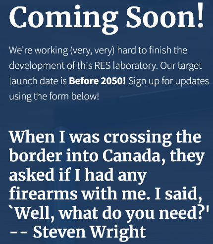

# Étape 4

Pour cette étape, nous avons dû procéder à 2 modifications :

1. Modifier la réponse du serveur pour que celui-ci renoive une réponse avec les
   bons headers,
2. Modifier la page `index.html` pour que celle-ci fasse une requête AJAJ (parce
   que JSON) et affiche le résultat.

## Code golang

Il s'agissait :
- de modifier la fonction `homePage` pour que la réponse soit transformée en
  JSON (`msg` étant une structure golang qui sera transformée en JSON)

```go
jsonResp, errj := json.MarshalIndent(msg, "", "    ")
w.Write(jsonResp)
```

mettre le bon `Content-Type` dans le Header de la réponse

```go
w.Header().Set("content-type", "application/json")
```

et écrire l'objet JSON en tant que contenu de la réponse.

```go
w.Write(jsonResp)
```

## Code HTML

Comme dans la webcast[^1], on a fait une fonction JavaScript qui fera une
requête AJAJ avec JQuery et modifie le sélecteur spécifié (`#message` chez
nous), voir le fichier `step1/src/js/fortune.js` pour ça.

Et on a supprimé le champ e-mail et son bouton pour avoir un titre `h2` avec le
contenu de la première fortune qui aura été récupérée.

[^1] : merci, c'est très pratique en vrai

# Utilisation

Pour exécuter cette infrastructure, il faudra faire comme à l'étape 3, car on a
testé ces opérations avec le reverse proxy.

# Test de la configuration

Nous pouvons voir le résultat après un premier chargement


Et après un deuxième chargement



Nous pouvons voir que les citations sont différentes à chaque chargement (si
RNGesus est avec nous, évidemment).
