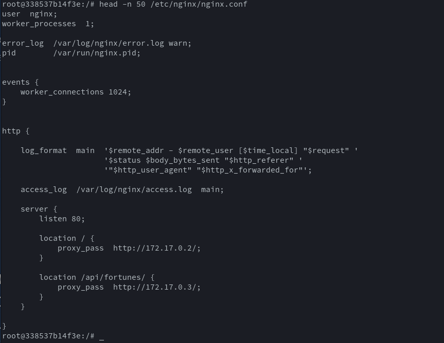

# Étape 5

Depuis la version 1.19 de l'image Docker NGINX, un [outil de template](https://www.gnu.org/software/gettext/manual/html_node/envsubst-Invocation.html)
 est intégré à l'image et est exécuté automatiquement au lancement de chaque machine. Il permet justement d'utiliser des variables d'environnement
dans un fichier de config.

Liens notables :
- Source officielle: https://github.com/docker-library/docs/tree/master/nginx#using-environment-variables-in-nginx-configuration
- Tutoriel plus complet : https://marcofranssen.nl/nginx-1-19-supports-environment-variables-and-templates-in-docker


## Configuration

Dans le fichier de configuration NGINX de l'étape 3, nous avons remplacé les adresses hard-codées 
par des variables de template :

```
    location / {
        proxy_pass	http://${STATIC_SERVER}/;
    }
    
    location /api/fortunes/ {
        proxy_pass	http://${DYNAMIC_SERVER}/;
    }
```

Les chaînes de caractères situées dans les accolades correspondent aux noms des variables d'environnement qui les remplaceront.

Pour que le moteur de template effectue la transformation, il fallait ajouter `.template` au nom du fichier de config et
copier le fichier dans le répertoire `/etc/nginx/templates/`.

Par défaut, les fichiers transformés sont écrits dans `/etc/nginx/conf.d/`, et ce chemin peut être changé avec la variable d'environnement `NGINX_ENVSUBST_OUTPUT_DIR`

## Dockerfile

La configuration du dockerfile est plutôt simple depuis l'image NGINX:

- Copier le fichier `nginx.conf.template` dans `/etc/nginx/templates`
- Modifier la variable d'environnement `NGINX_ENVSUBST_OUTPUT_DIR`
    - afin que le fichier `nginx.conf` soit écrit dans `/etc/nginx` pour écraser la config par 
    
## Démo

Après avoir lancé les deux serveurs HTTP et récupéré leur adresse IP, il faut juste ajouter les deux variables d'environnement dans la commande `run` de docker:

```bash
sudo docker run --detach --rm -p 8000:80 -e STATIC_SERVER=172.17.0.2 -e DYNAMIC_SERVER=172.17.0.3 --name proxy_dynamic res/s5
```

Si l'on va voir dans le fichier de configuration, on peut voir que les variables d'environnement ont bien été remplacées:

